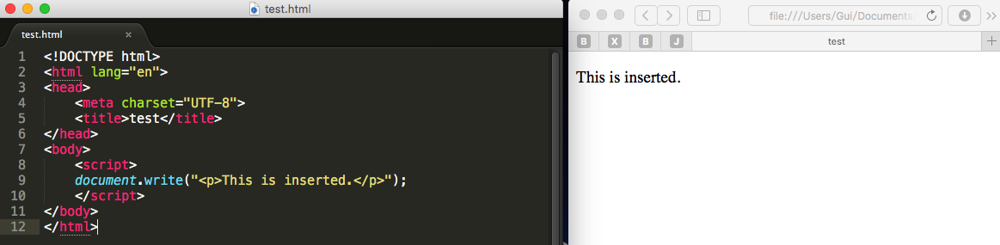

# javascript DOM编程艺术

（龟速更新中）
##数据类型
###字符串
####双引号和单引号
双引号单引号都可以

```
var test = "foo";
var test = 'foo';//这两句是一样的
```

```
var mood = "don't ask";
```
如果想要在上面的语句中使用单引号，需要对字符串don't中的单引号进行转义.对字符进行转义需要用到反斜杠符号“\”。

```
var mood = 'dont\'t ask';
```
###数值
整型

```
var age = 35;
```

浮点型

```
var age = 23.33;
```

负数

```
var temperature = -24.34;
```
###布尔值
布尔变量的值为true或false，需要注意不能带引号。

```
var sleeping = true;//布尔变量
var sleeping = "true";//字符串
```

###数组
使用Array声明一个数组

```
var beatles = Array(4);//四个元素的数组
var beatles = Array();//不定元素数量的数组
```
数组元素赋值

```
beatles[0] = "John";//从0开始
```
便捷方法

```
var beatles = Array("John", "Paul", "George", "Ringo");
var beatles = ["John", "Paul", "George", "Ringo"];//一个四个元素的数组
```

数组元素可以是不同类型

```
var stuff = [123,"你高兴就好",true];
```

数组下标可以是字符串

```
var lennon = Array();
lennon["name"] = "John";
lennon["year"] = 1940;
lennon["lining"] = false; //ps:这不是字典吗
```
数组的元素可以是另一个数组

```
var beatles = Array();
beatles[0] = lennon;
```

##操作
加法：字符串相加，会拼接字符串，字符串和数字相加，数字会转化为字符串，数字和数字相加，进行简单的算术运算

```
var message = 10 + 20; // = 30
var message = "10" + 20; // = "1020"
var message = "hello" + " world"; // = "hello world"
```
自增

```
var y = 1;
y++; // y=2
y += 1; //y=3
```

##条件语句

== 和 =

```
var k = 1;
if( k == 2) { // k不等于2，表达式“k == 2”求值结果为false
	//code
} else {
	//code
}
```
赋值语句的求值结果永远为true

```
var k = 1;
if( k = 2) { // k赋值为2，条件永远为真
	//code
}
```
##DOM
一份文档就是一棵节点树<br>
结点分为不同的类型：元素节点、属性节点、文本节点等<br>
`getElementById()`方法将返回一个<strong>对象</strong><br>
`getElementsBuTagName()`方法将返回一个<strong>对象数组</strong><br>
这些节点的每个，都是一个对象

###getAttribute()方法
```
var msg = document.getElementById("message");
alert(msg.getAttribute("id")); //显示："message"
```
###setAttrubite()方法
setAttribute(attributeName, value)

```
var shopping = document.getElementById("purchases");
shopping.setAttribute("title","a list of goods"); //shopping.title = "a list of goods"
```

使用`setAttrubite()`动态修改元素的属性，修改结果不会反映在源代码上，DOM的工作模式：先加载文档的静态内容，再以动态方式对他们进行刷新。

##事件处理函数
在给某个元素添加了事件处理函数后，一旦发生预定事件，相应的javascript 代码就会得到执行，那些javascript 代码可以返回一个结果，而这个结果将被传递回那个事件处理函数。
例如，我们可以给某个链接添加一个`onclick`事件处理函数，并让这个处理函数所触发的javascript 代码返回布尔值true或false。当这个链接被点击时，如果那段javascript 代码返回给`onclick`事件处理函数的值是true，`onclick`事件处理函数将认为“这个链接被点击了”，反之，在一个`<a>`元素的`onclick`属性中添加`return false;`，`onclick`事件处理函数认为“这个链接没有被点击”。所以链接不会被打开

##childNodes属性
`childNodes`属性让我们可以从给定文档的节点树里把任何一个元素的所有子元素检索出来.childNodes属性将返回一个数组

```
element.childNodes
```
##nodeName
<br>
<span style="font-size:70px; background:#777; border-radius:5px; color:white; margin-left:1em;">晚点再加...</span>
##nodeType
<br>
<span style="font-size:70px; background:#777; border-radius:5px; color:white; margin-left:1em;">晚点再加...</span>
##nodeValue
如果想要提取、改变某个元素（如：`<p>`元素）的文本，可以使用nodeValue。

```
//description是一个<p>元素
alert(description.nodeValue); // = null
//包含在<p>元素的文本是另一种节点，它在DOM里是<p>元素的第一个子节点。换句话说，想要获得<p>元素的文本内容，就必须检索它的第一个子节点的nodeValue属性值。
alert(description.childNodes[0].nodeValue);// = descriptionText
```

`childNodes[0]`通常用`firstChild`代替

#最佳实践
##伪协议

- 尽量不使用`javascript:`伪协议
- 不要这样写：`href="#"`

###`addLoadEvent()`
需要在window.onload中执行多个函数时，用一个统一的函数处理

```
function addLoadEvent(func) {
	var oldload = window.onload;
	if (typeof window.onload != 'function') {
		window.onload = func;
	} else {
		window.onload = function() {
			oldload();
			func();
		}
	}
}

addLoadEvent(functionA);
addLoadEvent(functionB);
```


##脚本的插入位置
脚本在标记中的位置对页面的初次加载时间有很大影响。一般我们把脚本放在文档的`<head>`区域。这种方法的一个问题是：位于`<head>`块中的脚本会导致浏览器无法并行加载其他文件，如其他脚本或图像。根据http规范，浏览器每次从同一个域名中最多只能同时下载两个文件。而在下载脚本期间，浏览器不会下载其他任何文件。即使是来自不同域名的也不会下载。所有其他资源都要等脚本加载完才会下载。把所有的`<script>`标签都放到文档的末尾，`</body>`标记之前，就可以让页面变得更快。

#动态创建标记

###document.write()



###innerHTML
一旦使用了innerHTML，原先的内容会全部被替换掉

###createElement(newElement)和appendChild(childName)

```
var div = document.getElementById("testdiv");
var newP = document.createElement("p"); //创建一个p标签元素
newP.innerHTML = "nodeName: " + newP.nodeName + " nodeType: " + newP.nodeType;
div.appendChild(newP); //div增加子节点
```
### 使用createTextNode(text)增加文本内容
```
window.onload = function() {
	var div = document.getElementById("testdiv");
	var newP = document.createElement("p");
	var txt = document.createTextNode("nodeName: " + newP.nodeName + " nodeType: " + newP.nodeType);
	//nodeType为1表示这是一个元素节点
	div.appendChild(newP);
	newP.appendChild(txt);
}
```

###insertBefore()
调用此方法时，你必须告诉它三件事：

- 新元素：你想插入的元素
- 目标元素：你想把这个新元素插入到哪个元素
- 父元素：目标元素的父元素

语法：`parentElement.insertBefore(newElement,targetElement);` <br>
我们不必搞清楚父元素到底是哪个，因为`targetElement`元素的`parentNode`属性就是它。

```
function demoForInsertBefore() {
	var gallery = document.getElementById("imageGallery");
	var description = document.getElementById("description");
	gallery.parentNode.insertBefore(gallery, description);//在description前面插入gallery
}
```

###insertAfter()
dom没有提供默认的insertAfter()方法，我们可以通过下面的函数实现这一功能

```
function insertAfter(newElem, target) {
	var parent = target.parentNode;
	if (parent.lastChild == target) {
		parent.appendChild(newElem);
	} else {
		parent.insertBefore(newElem,target.nextsibing);
	}
}
```

###new XMLHttpRequest()

`open()`方法有3个参数，指定请求类型，将要访问的文件，以及是否通过异步方式发送和处理

```
var request = new XMLHttpRequest();
request.open("GET","example.txt",true);
```
readyState有5个值<br>

- 0：未初始化
- 1：正在加载
- 2：加载完毕
- 3：正在交互
- 4：完成

访问服务器发送回来的数据要通过两个属性完成，一个是responseText属性，这个属性用于保存文本字符串形式的数据，另一个属性是responseXML属性，用于保存content-type头部中指定为"text/xml"的数据。


###Ajax
主要优势是对页面的请求以异步的方式发送到服务器。服务器不会用整个页面来响应请求，他会在后台处理请求，与此同时用户还能继续浏览页面并与页面交互。

## 第八章

###引用body的方法

```
//1
var body = document.getElementsByTagName("body")[0];
//2
var body = document.body;
```
javascript脚本只应该用来充实文档的内容，要避免使用DOM技术来创建核心内容